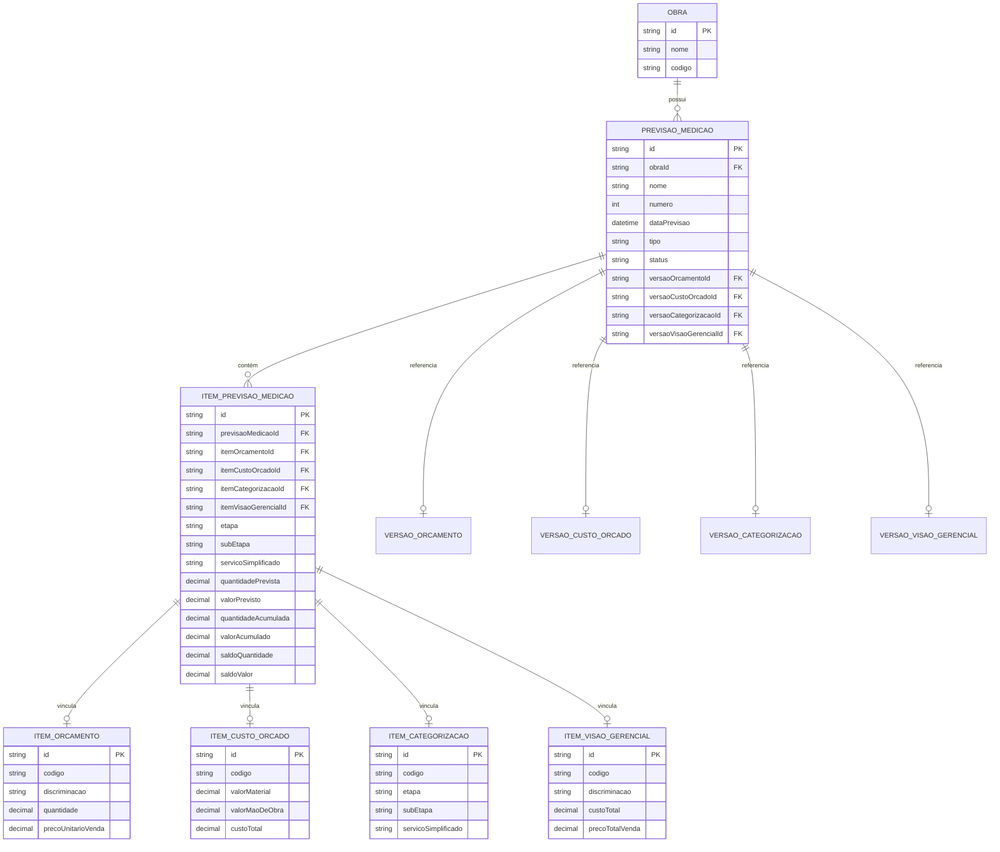
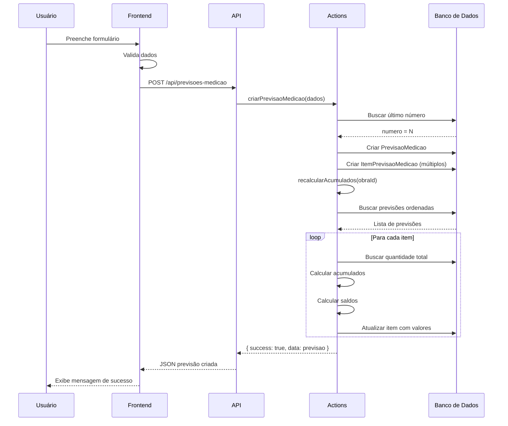
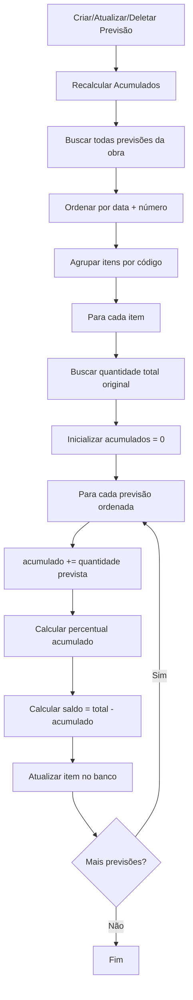
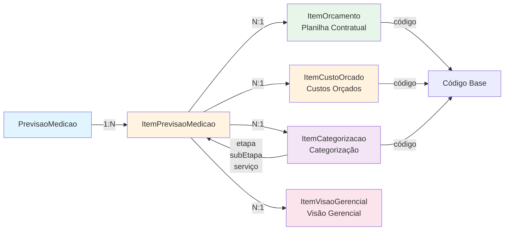
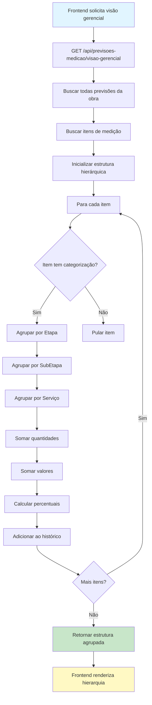
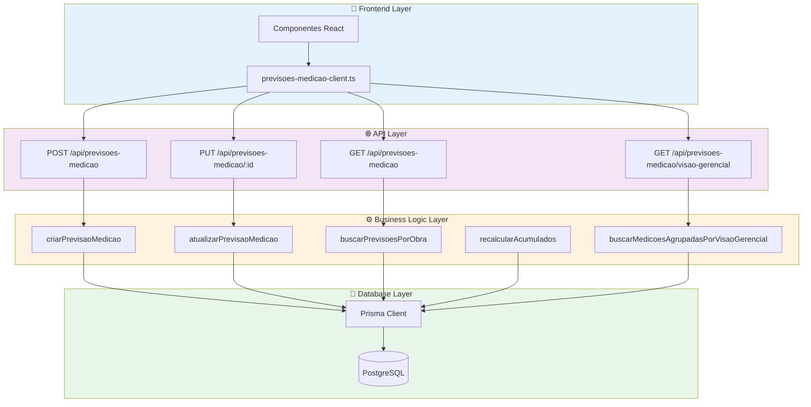
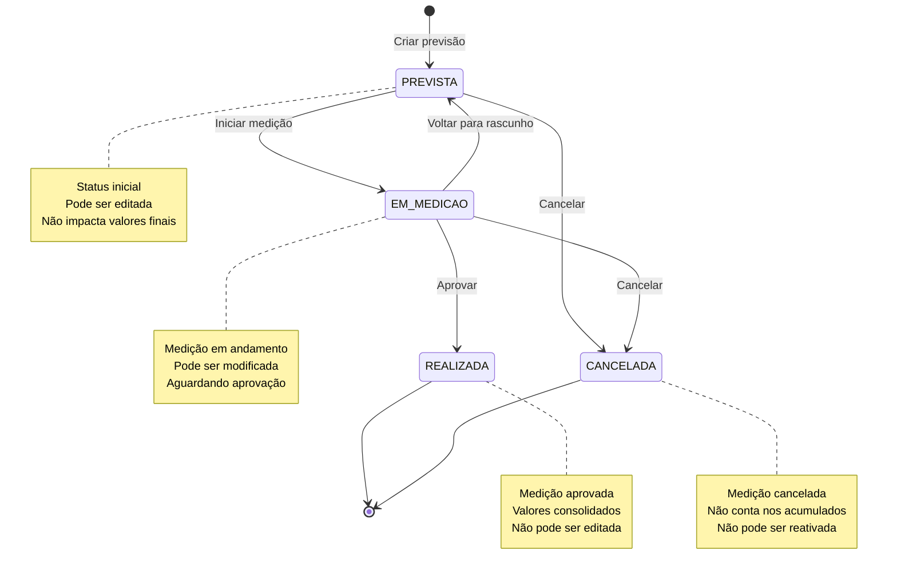
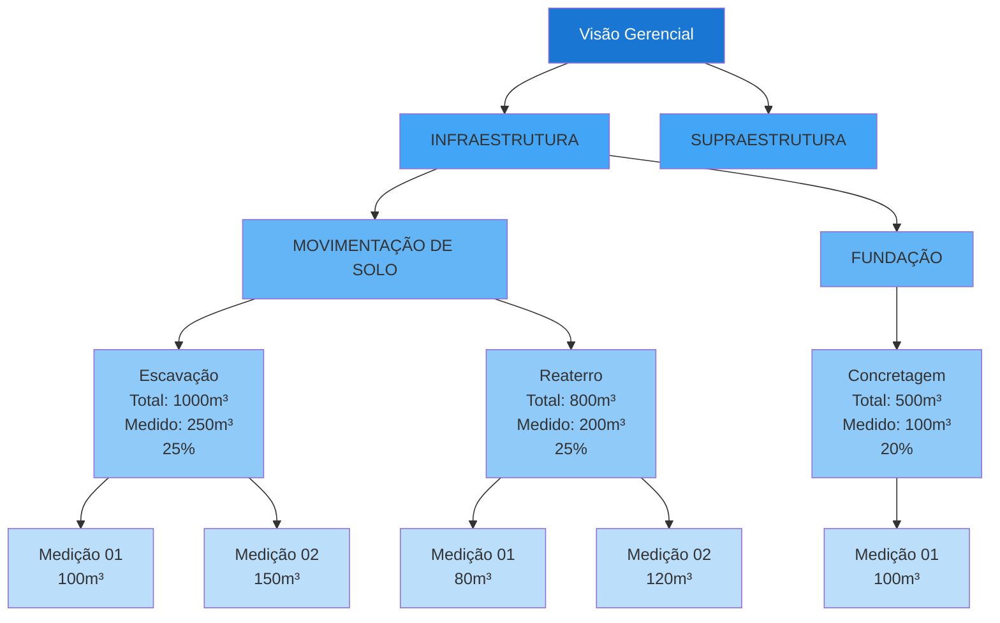
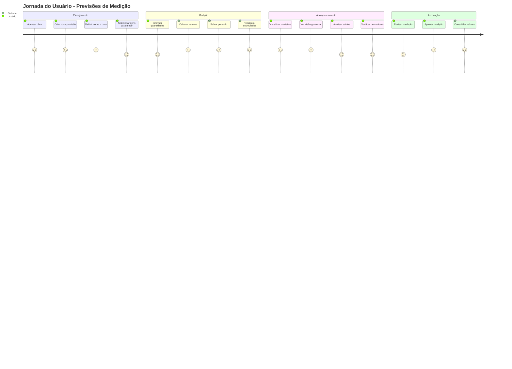

# 📊 Diagramas - Sistema de Previsões de Medição

## 1. Diagrama de Entidades e Relacionamentos (ERD)



## 2. Fluxo de Criação de Previsão



## 3. Fluxo de Cálculo de Acumulados



## 4. Estrutura de Vínculos entre Planilhas



## 5. Fluxo de Visualização por Visão Gerencial



## 6. Arquitetura de Camadas



## 7. Estados de uma Previsão de Medição



## 8. Exemplo de Dados Agrupados



## 9. Fluxo Completo de Uso



## 10. Relacionamento de Códigos entre Planilhas

```mermaid
flowchart LR
    subgraph VersaoOrcamento["Versão Orçamento"]
        IO1[ItemOrcamento<br/>código: 1.1.1<br/>Escavação manual]
        IO2[ItemOrcamento<br/>código: 1.1.2<br/>Escavação mecânica]
    end
    
    subgraph VersaoCustoOrcado["Versão Custo Orçado"]
        ICO1[ItemCustoOrcado<br/>código: 1.1.1<br/>MAT: R$100<br/>MO: R$200]
        ICO2[ItemCustoOrcado<br/>código: 1.1.2<br/>MAT: R$50<br/>MO: R$300]
    end
    
    subgraph VersaoCategorizacao["Versão Categorização"]
        IC1[ItemCategorizacao<br/>código: 1.1.1<br/>Etapa: INFRAESTRUTURA<br/>SubEtapa: MOVIMENTAÇÃO<br/>Serviço: Escavação]
        IC2[ItemCategorizacao<br/>código: 1.1.2<br/>Etapa: INFRAESTRUTURA<br/>SubEtapa: MOVIMENTAÇÃO<br/>Serviço: Escavação]
    end
    
    subgraph PrevisaoMedicao["Previsão de Medição"]
        IPM1[ItemPrevisaoMedicao<br/>itemOrcamentoId → IO1<br/>itemCustoOrcadoId → ICO1<br/>itemCategorizacaoId → IC1<br/>Qtd: 100m³]
        IPM2[ItemPrevisaoMedicao<br/>itemOrcamentoId → IO2<br/>itemCustoOrcadoId → ICO2<br/>itemCategorizacaoId → IC2<br/>Qtd: 50m³]
    end
    
    IO1 -.código 1.1.1.-> ICO1
    IO1 -.código 1.1.1.-> IC1
    
    IO2 -.código 1.1.2.-> ICO2
    IO2 -.código 1.1.2.-> IC2
    
    IPM1 --> IO1
    IPM1 --> ICO1
    IPM1 --> IC1
    
    IPM2 --> IO2
    IPM2 --> ICO2
    IPM2 --> IC2
    
    style VersaoOrcamento fill:#e8f5e9
    style VersaoCustoOrcado fill:#fff3e0
    style VersaoCategorizacao fill:#f3e5f5
    style PrevisaoMedicao fill:#e1f5ff
```

---

## Legenda

- 🎨 **Frontend**: Interface do usuário
- 🌐 **API**: Camada de endpoints HTTP
- ⚙️ **Actions**: Lógica de negócio
- 💾 **Database**: Persistência de dados
- 📊 **Visão Gerencial**: Visualização consolidada
- 🔗 **Vínculos**: Relacionamentos entre entidades

## Como visualizar os diagramas

Os diagramas acima usam a sintaxe Mermaid. Para visualizá-los:

1. Use um visualizador online: https://mermaid.live/
2. Use uma extensão do VSCode: Mermaid Preview
3. Visualize diretamente no GitHub (suporta Mermaid nativamente)
4. Use ferramentas como Notion, Obsidian, etc.
